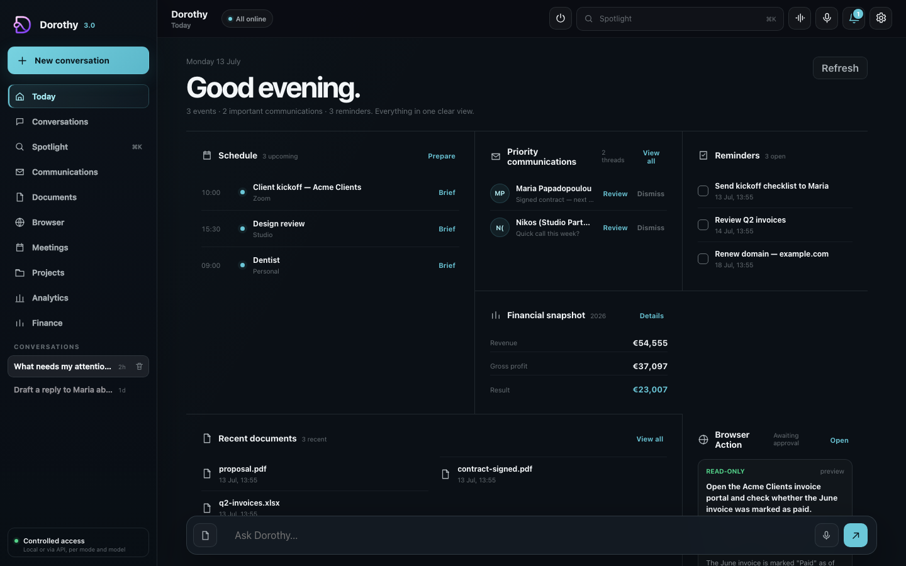
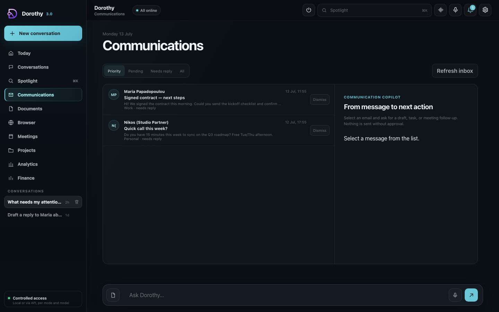
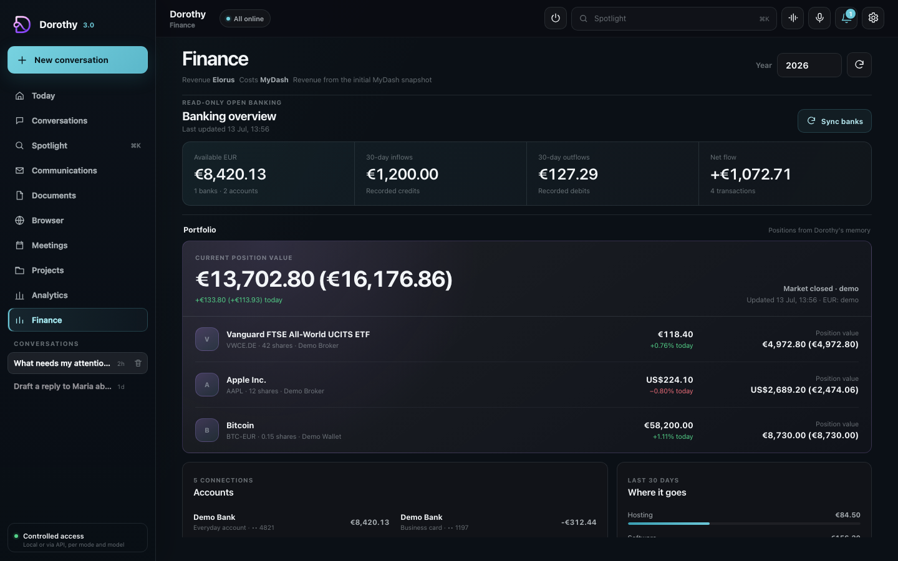
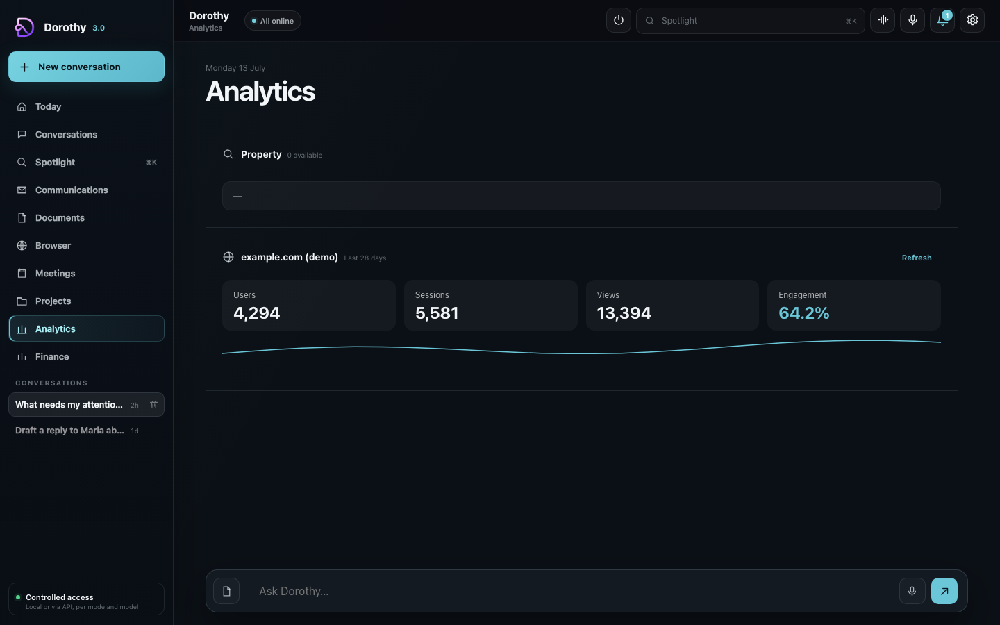
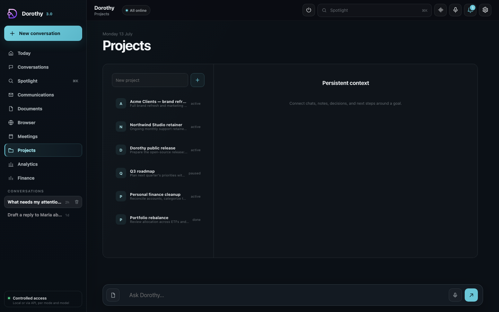
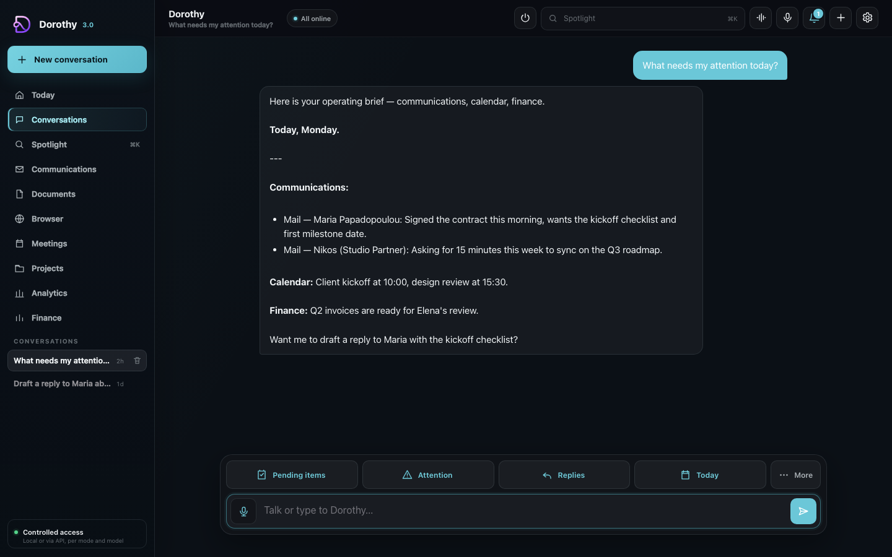

# Dorothy

[](https://github.com/andrikosbo/dorothy/actions/workflows/ci.yml)
[](LICENSE)

A self-hosted, local-first personal AI assistant. Dorothy runs on your own Mac
and combines a native-feeling web/PWA workspace, an [OpenClaw](https://openclaw.ai)
tool plugin for safe Mac/communications/finance control, and an optional
[n8n](https://n8n.io) backend for automation.

Everything is designed to run privately on a single machine. Nothing is exposed
publicly by default; remote access is meant to go through a private mesh such as
[Tailscale](https://tailscale.com).

> This is a clean, generic release. Bring your own credentials via the
> `.env.example` templates — no keys, tokens, or personal data are included.

## Screenshots

All data below is synthetic (`DOROTHY_DEMO_MODE=1` — see [Try it without connecting anything](#try-it-without-connecting-anything)).

| | |
| --- | --- |
|  |  |
|  |  |
|  |  |

## What's inside

| Folder | What it is |
| --- | --- |
| [`web/`](web/) | Dorothy Web — a private web/PWA workspace: chat, Today, communications, finance dashboard, voice, documents, and more. Node, zero runtime dependencies. |
| [`plugin/`](plugin/) | `dorothy-control` — an OpenClaw tool plugin (TypeScript) exposing safe, mostly read-only tools for Mac control, Mail/iMessage, Calendar, files, browser control, Elorus, and read-only open banking. |
| [`backend/`](backend/) | Optional automation layer: n8n via Docker, a small memory service, scheduling scripts (launchd), and prompt/config files. |

## Architecture

- **OpenClaw** is the assistant runtime and channel layer (local gateway).
- **Dorothy Web** is a thin client that talks to the OpenClaw agent.
- **n8n** is an optional backend for news/digest-style automation.
- **Ollama** and/or cloud models (e.g. Gemini) provide the LLM.

The assistant is intentionally cautious: communications and finance tools are
read-only by default, outbound actions require explicit confirmation, and there
is no unsolicited messaging.

## Quick start (web app)

```bash
cd web
cp .env.example .env          # then edit it
openssl rand -hex 32          # paste into DOROTHY_WEB_TOKEN
npm install                   # no dependencies, just sets up scripts
npm start                     # serves on http://127.0.0.1:3030
```

See [`web/README.md`](web/README.md) for the full security model and feature
list.

### Try it without connecting anything

```bash
cd web
cp .env.example .env
echo "DOROTHY_WEB_TOKEN=$(openssl rand -hex 32)" >> .env
echo "DOROTHY_DEMO_MODE=1" >> .env
npm install
npm start
```

With `DOROTHY_DEMO_MODE=1`, every real data source (Mail, iMessage, Calendar,
a bank connection, Elorus, Google Analytics) is replaced by realistic fixture
data from [`web/demo-data.js`](web/demo-data.js) — nothing on your Mac is
touched. This is exactly how the screenshots above were produced.

## Quick start (plugin)

```bash
cd plugin
npm install
npm run build                 # compiles TypeScript to dist/
```

See [`plugin/README.md`](plugin/README.md) for the full tool list and the
read-only policies.

## Optional backend (n8n)

```bash
cd backend
docker compose up -d          # n8n on http://localhost:5678
```

Set `N8N_ENCRYPTION_KEY` to a long random value before first run.

## Configuration

All secrets and machine-specific values come from environment files you create
yourself:

- `web/.env` (from `web/.env.example`)
- `backend/.env.automation` (from `backend/.env.automation.example`)

API keys for optional integrations (Gemini, Google TTS, HuggingFace, Elorus,
Enable Banking, etc.) are read at runtime from your environment or the macOS
Keychain and are never committed.

## License

[MIT](LICENSE).
